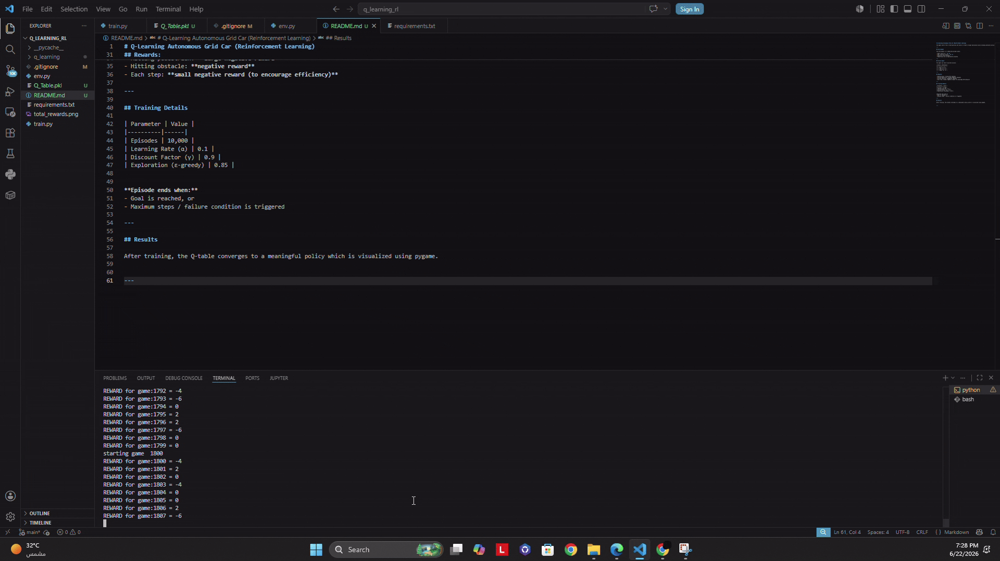

# Q-Learning Autonomous Grid Car (Reinforcement Learning)

The agent starts from a fixed position and learns to reach a target destination while avoiding obstacles and pedestrians using reinforcement learning.

---

## Environment

The environment is a **5×5 grid world** where:

- Agent starts at: `(4, 0)`
- Goal (delivery point): `(0, 4)`
- Obstacles block movement
- Pedestrians act as high-penalty hazards

---

## Action Space

The agent can take 4 discrete actions:

| Action | Direction |
|--------|----------|
| 0 | Up (-1, 0) |
| 1 | Down (+1, 0) |
| 2 | Left (0, -1) |
| 3 | Right (0, +1) |

---

## Rewards:

- Reaching goal: **+positive reward**
- Hitting pedestrian: **large negative reward**
- Hitting obstacle: **negative reward**
- Each step: **small negative reward (to encourage efficiency)**

---

## Training Details

| Parameter | Value |
|----------|------|
| Episodes | 10,000 |
| Learning Rate (α) | 0.1 |
| Discount Factor (γ) | 0.9 |
| Exploration (ε-greedy) | 0.85 |

**Episode ends when:**
- Goal is reached, or
- Maximum steps / failure condition is triggered

---

## Results

After training, the Q-table converges to a meaningful policy which is visualized using pygame.

---